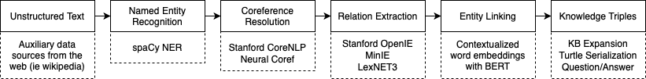

# KnowledgeGraph_Builder

**KnowledgeGraph_Builder** is an end-to-end pipeline for constructing knowledge graphs from unstructured text in the form of RDF triples. It utilizes technologies such as spaCy, Stanford CoreNLP, Neural Coref from Huggingface, and sentence-transformers to perform Named Entity Recognition, Coreference Resolution, Relation Extraction, and Entity-Linking. The goal here is to offer a novel knowledge representation method for applications in automated ontology construction and taxonomy expansion. The intuition here is that by extracting knowledge from text sources, this project will aid in solving the low coverage issue often faced with hand crafted knowledge bases.

## High-Level Pipeline

- Need to update^^

## Requirements

- `python >=3.7`
- `spacy`
- `pandas`
- `stanford-corenlp`
- `json`
- `nltk`
- [`miniconda`](https://docs.conda.io/en/latest/miniconda.html)

## Setup
1. Create new conda environment:\
   `conda env create -f environment.yml`
2. Activate environment:\
   `conda activate entitylink`
3. Download CoreNLP 4.2.0 and place in root folder of this repo:\
   [`https://stanfordnlp.github.io/CoreNLP/download.html`](https://stanfordnlp.github.io/CoreNLP/download.html)
   

## Usage
1. Add text of your choice in input.txt
2. Run `python text_to_graph.py input.txt`
3. Output will be `output_processed.csv`, containing triples of (entity1, relation, entity2)\

An example of an input and output is included in the `examples` folder

## Example Notebooks
Example notebooks can be found under the `notebooks` folder which contain
- Notebook_Text_to_Graph_Pipeline.ipynb
- Notebook_SpaCy_Parsing_OpenIE_BERT_Evaluation.ipynb
- Add more notebooks as necessary

For more information on this project, check out the [Wiki](https://github.com/RhythmSyed/KnowledgeGraph_Builder/wiki).
